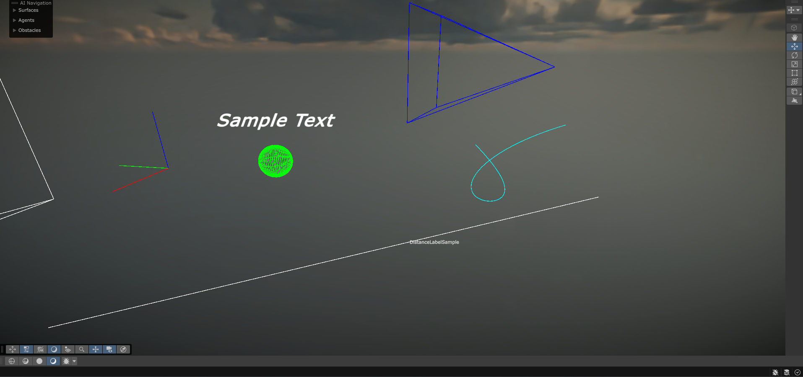

# 🧭 Advanced Gizmos for Unity

**Advanced Gizmos** is a powerful, developer-friendly extension to Unity's built-in Gizmos library. It offers a wide range of customizable and reusable visual debugging tools to enhance your scene visualization and editor workflow.

---

## 🔧 Features

- ✅ **3D Geometric Shapes**
  - Full sphere, Half-sphere, Cylinder, Capsule, Custom polygon, Triangle
- ✅ **Mesh Wireframe Visualization**
- ✅ **3D Bezier Curve Drawing**
- ✅ **Transform Axis Renderer**
- ✅ **Camera Frustum Visualization**
- ✅ **Distance Measurement with Labels**
- ✅ **Custom Isometric Text in Scene View**
- ✅ **Custom Arrows & Directional Lines**

---

## 🖼️ Example Usage

Attach the `Drawer.cs` script to any GameObject and enable specific drawing options from the inspector.
